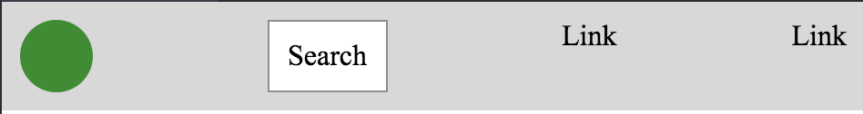
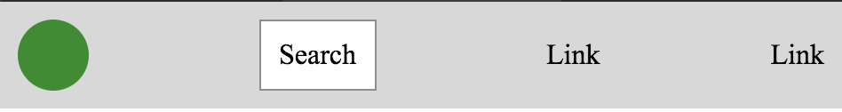
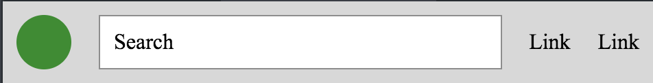
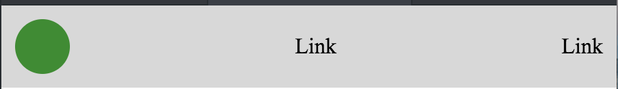

# Flexbox

## The Goal

Now that you've learned the in and outs of CSS Grid, you may think you've found the solution to all of your layout needs. But, as all of your favorite infomercials will tell you... there's more! Flexbox is a great way to easily achieve **one dimensional** layouts.

## The Lab
In this lab we'll start by looking at some of the core concepts of Flexbox and how to use them in our websites to create a basic navigation bar. By the end of the lab you'll be ramping it up and creating true navigational *art*.

You may find [this link](https://css-tricks.com/snippets/css/a-guide-to-flexbox/) useful as you work through the exercises below!

For each task you'll be working with the same `nav.html` and `nav.css` file. You'll be changing the `nav.css` file for each task. You can feel free to add more classes or ids as you see fit to `nav.html`, but all of the tasks below are accomplishable without doing so!

If you preview `nav.html` you'll see that some styling has already been applied to a few of the HTML elements.

#### The Container:
So, you may have noticed that your navbar doesn't look very.... navbar-esque right now. Let's start off by getting everything into one row. Check out your html file and figure out what your container element for your flexbox should be. Then, manipulate the **display**, **flex-direction** and **justify-content** properties to recreate the image below.

Try out at least two different values for the **flex-direction** property and **justify-content** property and check out how your page changes. Once you've explored a little, put your page back to how it was. You may notice that the "link" text looks a little funky being aligned at the top of the page. Use the **align-items** property to match the image below.

#### The Items:
Okay so, your layout is looking great... but our individual items have fallen behind. Right now our search bar doesn't really look like a search bar. Try using the **flex** property for the search bar item to accomplish the end result below:

This looks great with a searchbar, but what about all of the other style navbars you've seen on the internet? Go into `nav.html` and comment out the search bar div. Your page should change to look like this:

Topics:
* display: flex
* flex-direction: row
* flex property in individual items

#### Task Three:

Topics:
* display: flex
* flex-direction: row
* flex property in individual items
* justify - content
* align content

#### Task Four: Navbar

Nested flexbox --> have the flexbox items have text/images in them, create a row out of the items and then center the text

#### Stretch
<!-- replace the use of padding with flexbox -->
<!-- upperline's navbar: logo align far left and other content squished to the right -->
<!--  align self -->

<!-- do 3 or four screen shots along the way -->
<!-- want to break this up into: layout and content, then combine in a navbar -->
<!-- does it make sense to have the navbar elements have text, then have them use flex to center that text within the items as well? maybe as a stretch "nested flexbox" should that be a stetch?-->
